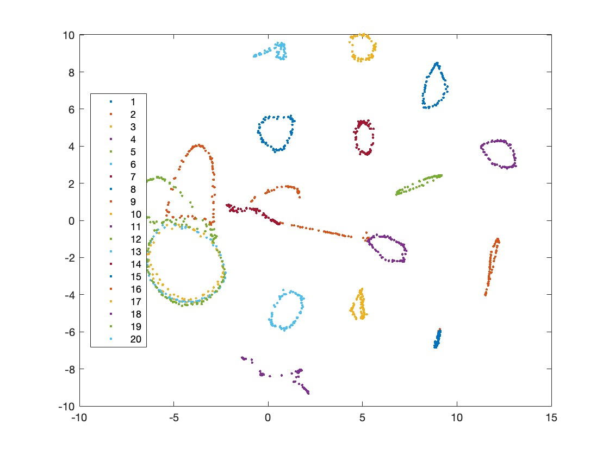

# 第十三次实验课

南子谦 3210104676

code:

```

clear
clc
load COIL20.mat

[m,n] = size(fea);k = 2;
% near / middle / reject
n_NB = 10;n_MN = 5;n_FP = 20;
% three stages
tau1 = 1;tau2 = 101;tau3 = 201; n_iter = 450;


%% preparation
% standard distance
D = pdist2(fea,fea);
[knn_dist,knn_index] = mink(D,8);
knn_dist = knn_dist(2:end,:);
knn_index = knn_index(2:end,:);
sigma_i = knn_dist(5:7,:);
sigma_i = mean(sigma_i);
Dn = D.^2./(sigma_i'*sigma_i);

% near neighborhood
A_NB = zeros(m,m);
[~,index] = sort(Dn);% index(i,j) = index of ith smallest distance to j
for i = 1:m
    % change A(i,:)
    for ii = 1:n_NB
        A_NB(i,index(ii,i)) = 1;
    end
end

% middle neighborhood
A_MN = zeros(m,m);
for i = 1:m
    for ii = 1:n_MN
        % 6 random numbers from 1 to m
        temp = ceil(rand(6,1)*m);
        dist = D(i,temp);
        [~,index] = sort(dist);
        % second nearest
        A_MN(i,temp(index(2))) = 1;
    end
end

% far neighborhood
A_FP = zeros(m,m);
for i = 1:m
    temp = 0;
    while temp < n_FP
        index = ceil(rand(1,1)*m);
        if A_NB(i,index)%if in A_NB
            continue
        else% not in A_FP
            A_FP(i,index) = 1;
            temp = temp + 1;
        end
    end
end

%% iteration
% initialize
Y = rand(m,k);figure_num = 1;
% stage one
for t = tau1:n_iter
    alpha = 1-t/n_iter;
    if t < tau2
        w_NB = 2;
        temp = (t-1)/(tau2-1);
        w_MN = 1000*(1-temp)+3*temp;
        w_FP = 1;
    elseif t < tau3
        % stage two
        w_NB = 3;
        w_MN = 3;
        w_FP = 1;
    else
        % stage three
        w_NB = 1;
        w_MN = 0;
        w_FP = 1;
    end
  
    gredient = zeros(m,k);
    for i = 1:m
        % near neighbor
        number_is1 = sum(A_NB(i,:));
        [~,index] = sort(A_NB(i,:),'descend');
            % index of 1 in A_NB(i,:)
        index = index(1:number_is1);

            % temp is the big \sum
        temp = zeros(number_is1,2); 
        for ii = 1:number_is1
            dij = norm(Y(i,:)-Y(index(ii),:))^2+1;
            temp(ii,:) = 20/(10+dij)^2*(Y(i,:)-Y(index(ii),:));
        end
        gredient(i,:) = gredient(i,:) + w_NB*sum(temp);

        % middle neighbor
        number_is1 = sum(A_MN(i,:));
        [~,index] = sort(A_MN(i,:),'descend');
            % index of 1 in A_NB(i,:)
        index = index(1:number_is1);
            % temp is the big \sum
        temp = zeros(number_is1,2); 
        for ii = 1:number_is1
            dij = norm(Y(i,:)-Y(index(ii),:))^2+1;
            temp(ii,:) = 20000/(10000+dij)^2*(Y(i,:)-Y(index(ii),:));
        end
        gredient(i,:) = gredient(i,:) + w_MN*sum(temp);

        % far neighbor
        number_is1 = sum(A_FP(i,:));
        [~,index] = sort(A_FP(i,:),'descend');
            % index of 1 in A_NB(i,:)
        index = index(1:number_is1);
            % temp is the big \sum
        temp = zeros(number_is1,2); 
        for ii = 1:number_is1
            dij = norm(Y(i,:)-Y(index(ii),:))^2+1;
            temp(ii,:) = -1/(1+dij)^2*(Y(i,:)-Y(index(ii),:));
        end
        gredient(i,:) = gredient(i,:) + w_FP*sum(temp);
    end
    % update Y after calculating gredient for each sample
    while norm(gredient,'inf') > 2
        gredient = gredient / norm(gredient,'inf') * 2;
    end
    disp("iter "+t+" gredient_infnorm: "+norm(gredient,'inf'))
    Y = Y - alpha*gredient;
    if rem(t,50) == 0
        figure(figure_num)
        gscatter(Y(:,1),Y(:,2),gnd);
        pause(1)
        figure_num = figure_num+1;
    end
end

gscatter(Y(:,1),Y(:,2),gnd);


```

photo:
250

350

450
